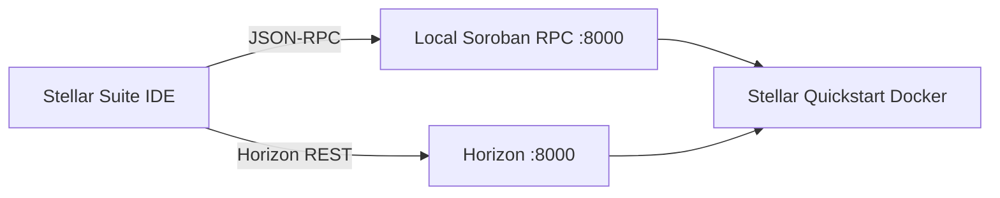

# Local Soroban Sandbox Environment

Run a local Stellar/Soroban node with Docker and point the Stellar Suite IDE at `localhost` for offline-first contract development.

## Overview



## Prerequisites

- Docker Engine 24+ with `docker compose` or `docker run`
- Stellar Suite IDE (`ide/` package) running locally or deployed
- A funded test keypair (Friendbot on local networks)

## 1. Start the local sandbox (Quickstart)

Pull and run the official Stellar Quickstart image in **local** mode:

```bash
docker run --rm -it \
  -p 8000:8000 \
  --name stellar-quickstart \
  stellar/quickstart:latest \
  --local --enable-soroban-rpc
```

Wait until the container logs show Horizon and Soroban RPC are ready (typically 30–90 seconds on first boot).

Verify the RPC endpoint:

```bash
curl -s http://localhost:8000/rpc \
  -H 'Content-Type: application/json' \
  -d '{"jsonrpc":"2.0","id":1,"method":"getHealth"}' | jq .
```

Expected: a JSON-RPC response with `"status":"healthy"` (or equivalent) from the local node.

### Optional: persist ledger data

```bash
docker volume create stellar-local-data

docker run --rm -it \
  -p 8000:8000 \
  -v stellar-local-data:/opt/stellar \
  --name stellar-quickstart \
  stellar/quickstart:latest \
  --local --enable-soroban-rpc
```

## 2. Fund a test account (Friendbot)

```bash
curl "http://localhost:8000/friendbot?addr=GXXXXXXXXXXXXXXXXXXXXXXXXXXXXXXXXXXXXXXXXXXXXXXXXXXXXXXX"
```

Replace the `G…` address with your IDE identity public key.

## 3. Point the IDE to localhost

### Network preset

1. Open **Settings → Network** (or the network selector in the status bar).
2. Choose **Local**.
3. Confirm defaults:
   - **RPC URL:** `http://localhost:8000`
   - **Horizon URL:** `http://localhost:8000`
   - **Passphrase:** `Local Stellar Network`

### Custom RPC (shared environments)

If your team uses **Settings → Environment → Custom Networks**:

| Field | Value |
| --- | --- |
| Label | `Local Sandbox` |
| RPC URL | `http://localhost:8000` |
| Passphrase | `Local Stellar Network` |

Enable **Share with team** only when distributing a team-wide staging config; keep local sandboxes personal by default.

### Environment variables (optional)

For scripted deployments against the same node:

```bash
export STELLAR_RPC_URL=http://localhost:8000
export STELLAR_NETWORK_PASSPHRASE="Local Stellar Network"
```

## 4. Validate in the IDE

1. Build a sample contract (`hello_world` template).
2. Deploy to the **Local** network.
3. Run **Simulate** on a contract method — results should return without public testnet latency.
4. Open **State Explorer** to inspect ledger keys after simulation.

## Troubleshooting

| Symptom | Fix |
| --- | --- |
| `Network error: Unable to reach RPC` | Ensure Docker is running and port `8000` is not used by another service. |
| CORS errors in the browser | Use the IDE on `localhost` or configure your reverse proxy to allow the IDE origin. |
| Transactions fail with bad sequence | Reset the container or fund the account again via Friendbot. |
| Slow first simulation | Quickstart may still be ingesting ledgers; wait for health check to pass. |

## Security notes

- The local Quickstart image is for **development only** — never expose port `8000` to the public internet without authentication.
- Do not reuse mainnet secret keys on local sandboxes.

## Related guides

- [Simulation walkthrough](../tutorials/simulation-guide.md)
- [Custom deployment](./custom-deployment.md)
